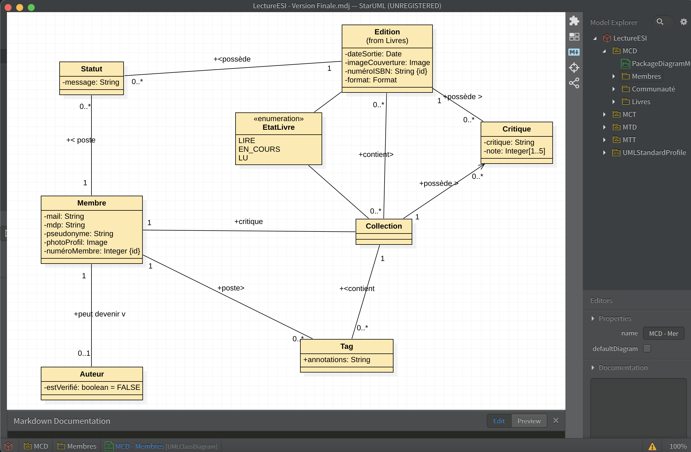
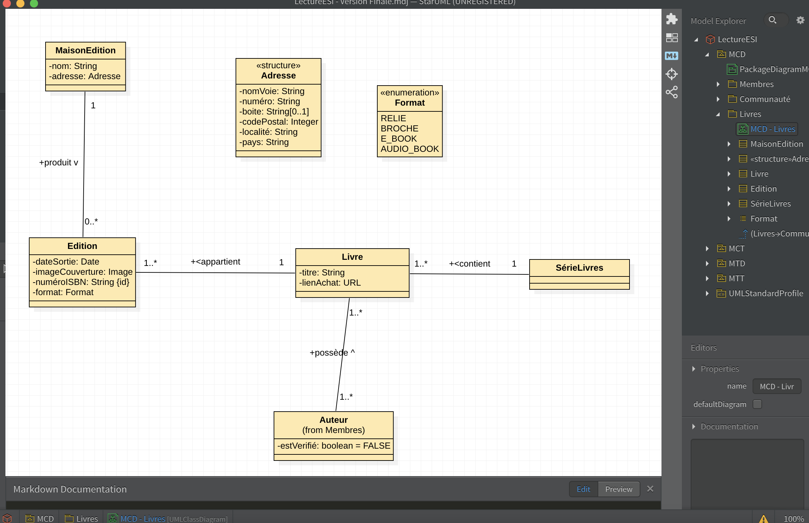
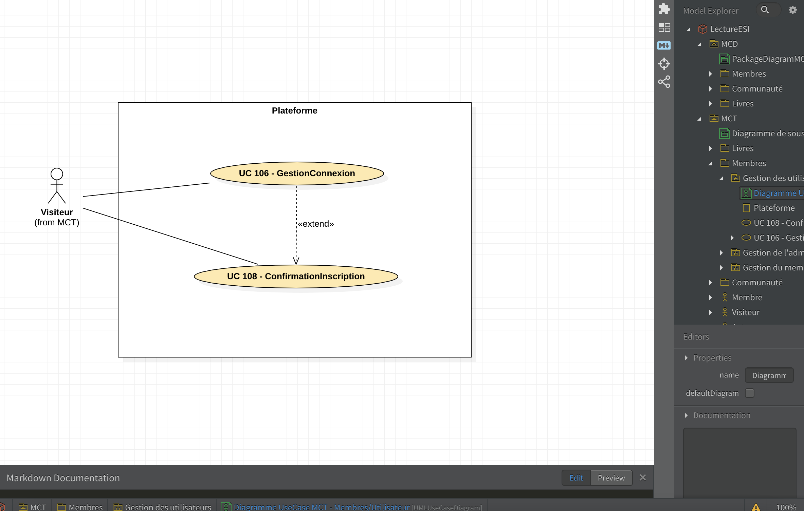
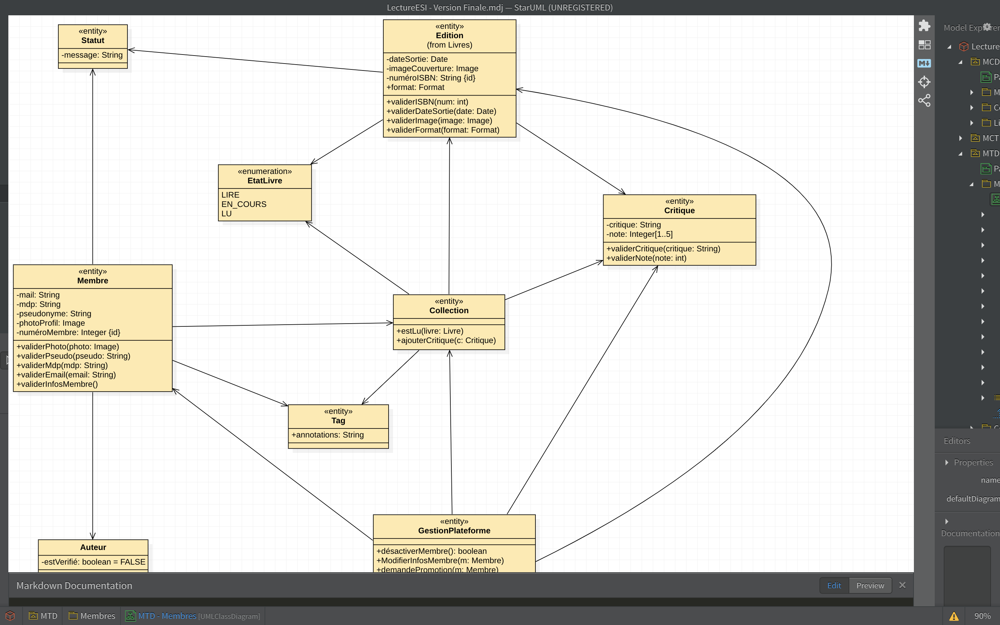
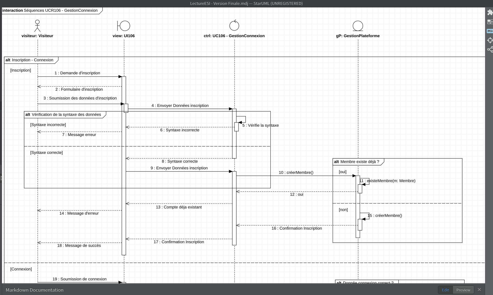

# ANALYSE-project

This repository contains a project technically analysed by four group members (Yacine MAMLOUK, Simon LERUTH, Jalil ECHAMS, and myself)
The project consists of plateform [lectureEsi] that combines library and social newtwork
Differents actors are highlighted. Such as author, member (user) and platform administration.

## Process

1. Creation of Class Diagrams
2. Creation of Use Cases Diagrams
3. Creation of Activity Diagrams
4. Creation of Sequence Diagrams
5. Tests

As the file's size is too big, the project cannot be display here. It has to be downloaded.

This project is designed with StarUml.

